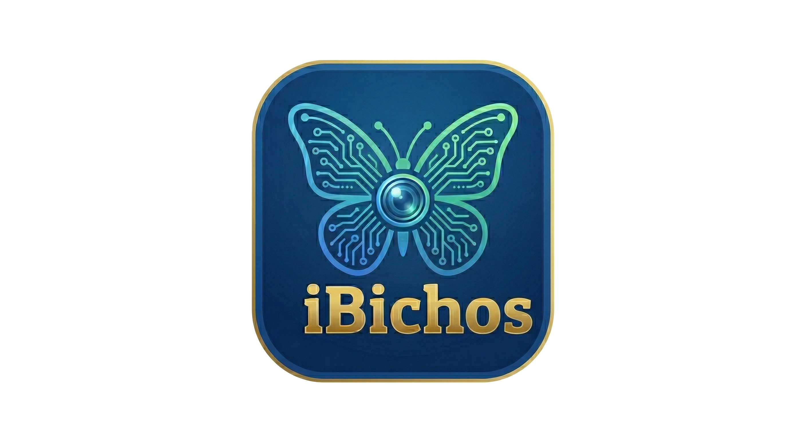

  
  <h1>🦟 iBichos</h1>
  
<strong>Caza, Colecciona y Explora tu Ecosistema</strong>

**iBichos** es una aplicación móvil nativa para Android diseñada como Proyecto de Título. Fusiona heurísticas de educación ambiental con dinámicas de **gamificación pasiva** (similares a Pokémon GO). La aplicación utiliza Inteligencia Artificial para identificar taxonómicamente insectos a través de la cámara del celular, fomentando la exploración del entorno y la concientización sobre la microfauna.

---

## 🎯 Alcance Funcional (Lo que la App HACE ✅)

La arquitectura de este MVP (Producto Mínimo Viable) se ha trazado estrictamente para cumplir los siguientes hitos:

1. **Autenticación y Perfilamiento:** Login y Registro de usuarios centralizado usando Firebase Auth.
2. **Reconocimiento con IA (Kindwise API):** Procesamiento de imágenes en la nube que determina la identidad biológica (Familia/Especie), el nombre vernacular, y el "Nivel de Peligro" (Inofensivo, Venenoso, Plaga) de la captura.
3. **Álbum Personalizado (La Pokedex):** Un inventario persistente en la nube donde el usuario almacena todas sus capturas ordenadas cronológicamente junto a sus metadatos biológicos completos.
4. **Mapa de Ecosistema:** Mapeo geolocalizado en tiempo real (vía GPS) sobre mapas rasterizados (*OSMDroid*) situando pines exactamente donde se realizó la captura biológica.
5. **Gamificación y Ranking:** Sistema que otorga subidas de Puntos de Experiencia (XP), condecoración de medallas y conteo de especies únicas. El progreso de todos los usuarios compite en una "Pizarra de Prestigio" dinámica alojada en Firebase Firestore.
6. **Optimización Extrema de Costos Backend:** Las imágenes (fotos de insectos y avatares de perfil) se almacenan estrictamente como *Local URIs* en el dispositivo, evitando saturar el _Billing_ de la capa Firebase Storage, haciéndola académica e institucionalmente sustentable.

---

## 🛑 Limitaciones de Scope (Lo que la App NO HACE ❌)

Para garantizar la culminación académica del proyecto previniendo el *Scope Creep* (Aumento descontrolado del alcance), se han definido contractualmente los siguientes límites:

* **No es una Red Social Interactiva:** No posee sistema de "Añadir Amigos", "Chat en Vivo", Mensajería Directa ni foros de discusión. Es una experiencia _Single-Player_ competitiva pasiva.
* **No posee Mercado Múltiple ni Tiendas:** No existen microtransacciones ni monedas virtuales para comprar mejoras o cosméticos dentro de la aplicación.
* **Agnóstico a Multiplataforma:** Solución puramente diseñada bajo el framework de Android (Jetpack Compose). **No** posee versión para iOS en este iterativo.
* **Sin Sincronización de Archivos Pesados en la Nube:** Debido al coste estructural, las imágenes no se sincronizan en la nube. Si el usuario pierde el teléfono, su "Puntaje" se mantiene en Firestore, pero las imágenes locales podrían cortarse si no son respaldadas nativamente por Google Photos.

---

## 🛠 Arquitectura y Patrones de Diseño

El proyecto fue reestructurado enteramente aplicando estándares de la industria móvil moderna:

- **Clean Architecture & MVVM:** Separación tricapa (`Data`, `Domain`, `Presentation`) orquestada por ViewModels para la inyección de estados en UI.
- **Single-Activity Architecture:** Solo existe un frágil `MainActivity`. Todas las vistas son composables atómicos que viajan en un sub-NavHost de Compose Navigation.
- **UI Toolkit Declarativo:** 100% construido en *Google Jetpack Compose* (Material Design 3), erradicando las legadas vistas XML.
- **Base de Datos NoSQL Optimizada:** Uso estratégico de *Flat Data* modelando Arrays incrustados (`medals: []`) y colecciones independientes pre-indexadas (`users`, `captures`) en Firestore para lograr tiempos de lectura O(1) de milisegundos en la carga del ranking mundial. 

---

## ⚙️ Correr el Proyecto (Desarrollo)

Para que un profesor u evaluador corra localmente el código fuente se necesita:

1. **Clonar** este repositorio e importarlo en *Android Studio Koala / Ladybug* (o superior).
2. **Archivos Protegidos:** Proveer el archivo `google-services.json` (Firebase base) situándolo en la carpeta `/app`.
3. **Credenciales AI:** El archivo de API (`KindwiseApi.kt`) requiere una llave activa si se desea re-ensamblar la comunicación real con la red neuronal de Entomología (PlantNet/Kindwise API). De lo contrario, usará su *MockInterceptor* por defecto.
